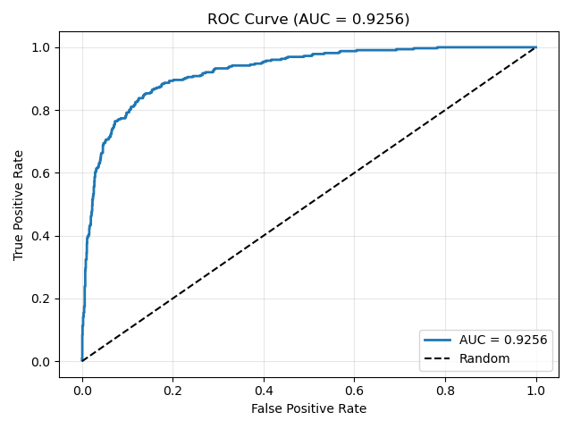
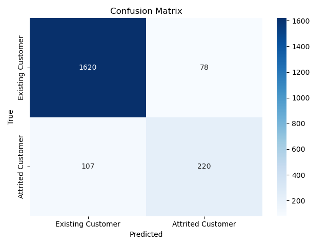

# BankChurners Customer Churn Prediction Using NumPy

## 1. Project Title and Short Description
**BankChurners Customer Churn Prediction Using NumPy**  
A mini-project to predict credit card customer churn using only NumPy for data processing, feature engineering, and model implementation from scratch. The project demonstrates efficient NumPy techniques for handling tabular data and building a logistic regression model.

## 2. Table of Contents
- [BankChurners Customer Churn Prediction Using NumPy](#bankchurners-customer-churn-prediction-using-numpy)
  - [1. Project Title and Short Description](#1-project-title-and-short-description)
  - [2. Table of Contents](#2-table-of-contents)
  - [Introduction](#introduction)
    - [Problem Description](#problem-description)
    - [Motivation and Real-world Applications](#motivation-and-real-world-applications)
    - [Specific Objectives](#specific-objectives)
  - [Dataset](#dataset)
  - [Methodology](#methodology)
    - [Data Processing Pipeline](#data-processing-pipeline)
    - [Algorithm Used](#algorithm-used)
    - [Detailed Implementation with NumPy](#detailed-implementation-with-numpy)
  - [Installation \& Setup](#installation--setup)
  - [Usage](#usage)
  - [Results](#results)
  - [Project Structure](#project-structure)
  - [Challenges \& Solutions](#challenges--solutions)
  - [Future Improvements](#future-improvements)
  - [Contributors](#contributors)
  - [License](#license)

## Introduction
### Problem Description
The project addresses customer attrition in a credit card portfolio. Churn prediction involves identifying customers likely to close their accounts based on usage patterns, demographics, and transaction history.

### Motivation and Real-world Applications
Customer churn costs banks millions in lost revenue. Predicting churn allows proactive retention strategies, such as personalized offers, improving customer lifetime value. In real-world banking, this model can integrate into CRM systems for targeted marketing.

### Specific Objectives
1. Process and analyze the dataset using only NumPy for efficiency.  
2. Implement a logistic regression model from scratch to predict churn.  
3. Achieve an AUC score of at least 0.90 on validation data.  
4. Provide actionable business insights from model results.

## Dataset
- **Source**: Kaggle - Credit Card Customers Dataset.  
- **Features Description**: 21 columns, including numerical (e.g., Customer_Age, Credit_Limit, Total_Trans_Ct) and categorical (e.g., Gender, Education_Level, Marital_Status). Selected 18 relevant features for modeling.  
- **Size and Characteristics**: 10,127 samples (rows), 21 columns. Imbalanced target (Attrition_Flag): ~16% churned. No missing values in numerical features, "Unknown" in some categorical (handled by mode imputation).

## Methodology
### Data Processing Pipeline
1. Load CSV using np.genfromtxt.  
2. Handle "Unknown" in categorical features using mode replacement (vectorized masking).  
3. One-hot encode categorical features using boolean masks.  
4. Feature engineering: Create 3 new features (util_ratio, avg_trans_amt, inactive_flag) via vectorized operations (e.g., division and thresholding).  
5. Standardize features using Z-score  
6. Train-val split (80/20) using np.random.permutation for shuffling.

### Algorithm Used
Logistic Regression from scratch with gradient descent. Mathematical formulas:

**Logistic regression model:**
$$
\begin{align}
  f_{\mathbf{w},b}(\mathbf{x^{(i)}}) &= g(z^{(i)}) \\
  z^{(i)} &= \mathbf{w} \cdot \mathbf{x}^{(i)}+ b \\
  g(z^{(i)}) &= \frac{1}{1+e^{-z^{(i)}}} 
\end{align}
$$
**Cost function:**
$$ J(\mathbf{w},b) = \frac{1}{m} \sum_{i=0}^{m-1} \left[ loss(f_{\mathbf{w},b}(\mathbf{x}^{(i)}), y^{(i)}) \right] $$
**Lost function:**
$$loss(f_{\mathbf{w},b}(\mathbf{x}^{(i)}), y^{(i)}) = -y^{(i)} \log\left(f_{\mathbf{w},b}\left( \mathbf{x}^{(i)} \right) \right) - \left( 1 - y^{(i)}\right) \log \left( 1 - f_{\mathbf{w},b}\left( \mathbf{x}^{(i)} \right) \right) $$
**Gradient descent:**
Recall the gradient descent algorithm utilizes the gradient calculation:
$$\begin{align*}
&\text{repeat until convergence:} \; \lbrace \\
&  \; \; \;w_j = w_j -  \alpha \frac{\partial J(\mathbf{w},b)}{\partial w_j}   \; & \text{for j := 0..n-1} \\ 
&  \; \; \;  \; \;b = b -  \alpha \frac{\partial J(\mathbf{w},b)}{\partial b} \\
&\rbrace
\end{align*}$$

Where each iteration performs simultaneous updates on $w_j$ for all $j$, where
$$\begin{align*}
\frac{\partial J(\mathbf{w},b)}{\partial w_j}  &= \frac{1}{m} \sum\limits_{i = 0}^{m-1} (f_{\mathbf{w},b}(\mathbf{x}^{(i)}) - y^{(i)})x_{j}^{(i)}  \\
\frac{\partial J(\mathbf{w},b)}{\partial b}  &= \frac{1}{m} \sum\limits_{i = 0}^{m-1} (f_{\mathbf{w},b}(\mathbf{x}^{(i)}) - y^{(i)}) 
\end{align*}$$

Implementation in NumPy: Vectorized dot products (np.dot) for efficiency, epsilon (1e-8) for numerical stability.

### Detailed Implementation with NumPy
All operations use broadcasting, masking, and ufuncs (e.g., np.exp, np.log)

## Installation & Setup
1. Clone the repository: `[https://github.com/crazizorba/Numpy-For-Data-Science.git]`  
2. Install dependencies: `pip install -r requirements.txt` (numpy, matplotlib, seaborn, jupyter)  
3. Place `BankChurners.csv` in `data/raw/` or not (because of pre-setting in this reposity).

## Usage
1. Open Jupyter: `jupyter notebook`.  
2. Run `notebooks/01_data_exploration.ipynb` for exploring data.  
3. Run `notebooks/02_preprocessing.ipynb` to preprocess and save processed data.  
4. Run `notebooks/03_modeling.ipynb` to train and evaluate the model.

## Results
- **Metrics on Validation Set**:  
  Accuracy: 0.9086  
  Precision: 0.7383  
  Recall: 0.6728  
  F1-score: 0.7040  
  AUC: 0.9256  

- **Visualizations**:  
  - ROC Curve (AUC = 0.9260):  
    

  - Confusion Matrix:  
    

  - Feature Importance (Top 15):  
    

- **Analysis**: The model achieves a high AUC (0.9256), indicating strong discriminative power.

## Project Structure
- `data/raw/`: Original dataset (BankChurners.csv).
- `data/processed/`: Processed NumPy arrays (X_train.npy, etc.) for fast loading.
- `notebooks/`: Jupyter notebooks for exploration (01), preprocessing (02), and modeling (03).
- `src/`: Reusable modules.
  - `data_processing.py`: Load, clean, encode, scale, split functions.
  - `visualization.py`: Plotting functions (histogram, ROC, etc.).
  - `models.py`: LogisticRegression class and metrics.
- `figures/`: Saved visualizations (ROC, confusion matrix).
- `requirements.txt`: Dependencies list.  
- `README.md`: This file.

## Challenges & Solutions
- **Challenge**: No Pandas for data manipulation – hard to inspect and clean.
  - **Solution**: Used NumPy masking and ufuncs for vectorized operations; added pretty-print functions for inspection.

- **Challenge**: Implementing logistic regression from scratch without Scikit-learn.
  - **Solution**: Vectorized gradient descent with broadcasting; added epsilon for log stability and L2 regularization to prevent overfitting.

- **Challenge**: Handling imbalanced data (16% churn).
  - **Solution**: Focused on AUC metric; tuned threshold for better recall.

- **Challenge**: Numerical stability in loss/sigmoid.  
  - **Solution**: Added 1e-8 in log and division to avoid NaN/zero errors.

## Future Improvements
- Implement k-fold cross-validation from scratch with NumPy for better evaluation.
- Add more advanced features (e.g., interaction terms like Age * Income_Category).
- Try Naive Bayes from scratch as an alternative model.  
- Integrate with a simple Flask app for real-time predictions.

## Contributors
- **Author**: Tran Dinh Thi
- **Student ID**: 23120359
- **Email**:  [23120359@student.hcmus.edu.vn]
- **GitHub**: [github.com/crazizorba]

## License
**Course**: CSC17104 - Programming for Data Science  
**Instructor**: Pham Trong Nghia, Le Nhat Nam  
**Institution**: Faculty of Information Technology,  
University of Science, Vietnam National University - Ho Chi Minh City  (US, VNU-HCMUS)

**Academic Use Only**  
This repository is created for educational purposes only.  
Other students are welcome to reference the code for learning, but **must not copy directly** when submitting their own assignments.  
Commercial use is not permitted.

© 2025 [Tran Dinh Thi] - All rights reserved for academic integrity.